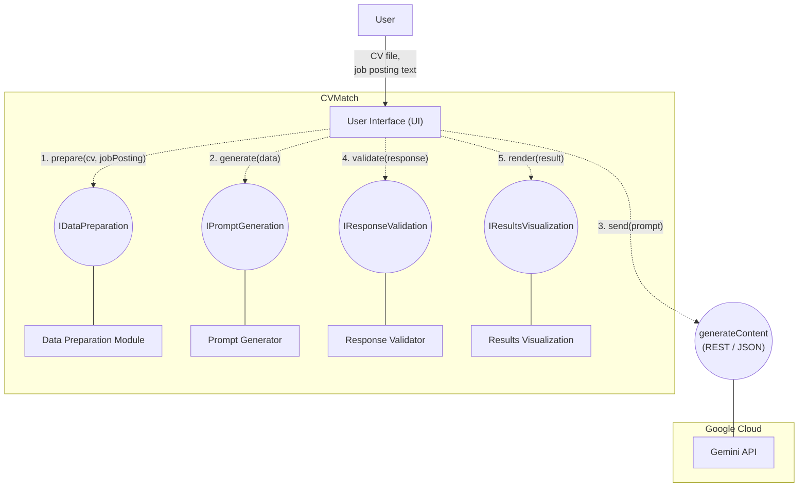
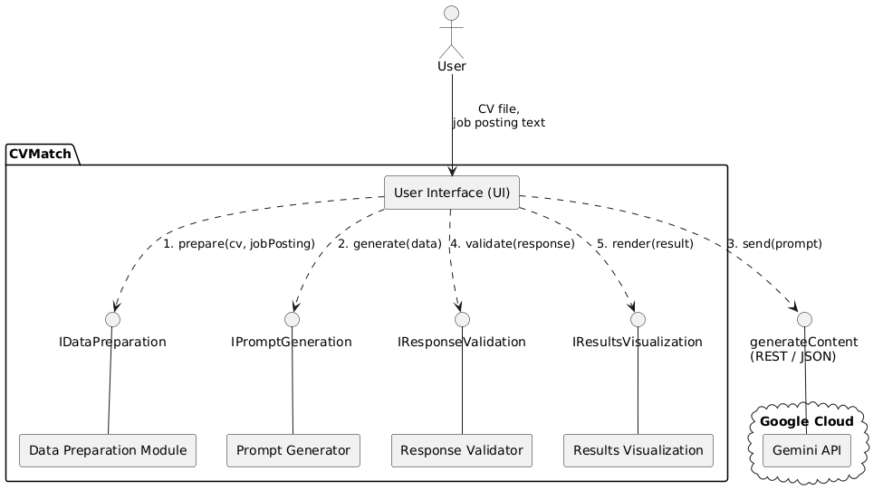
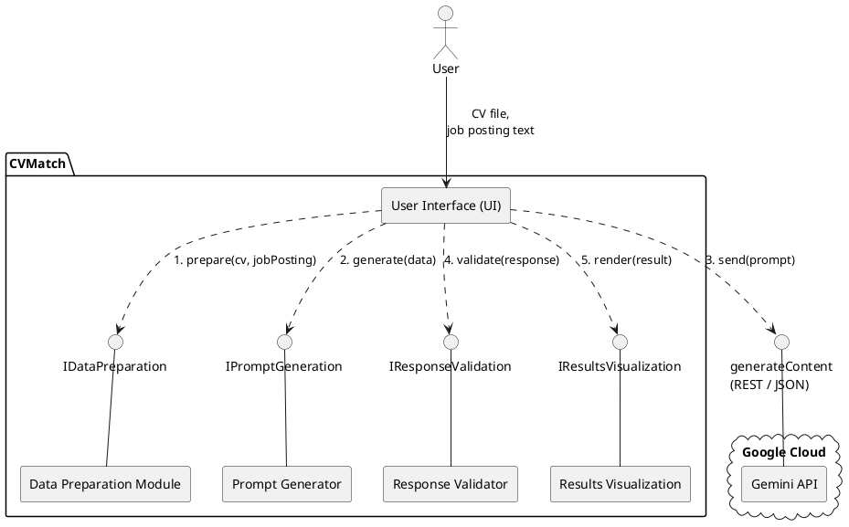
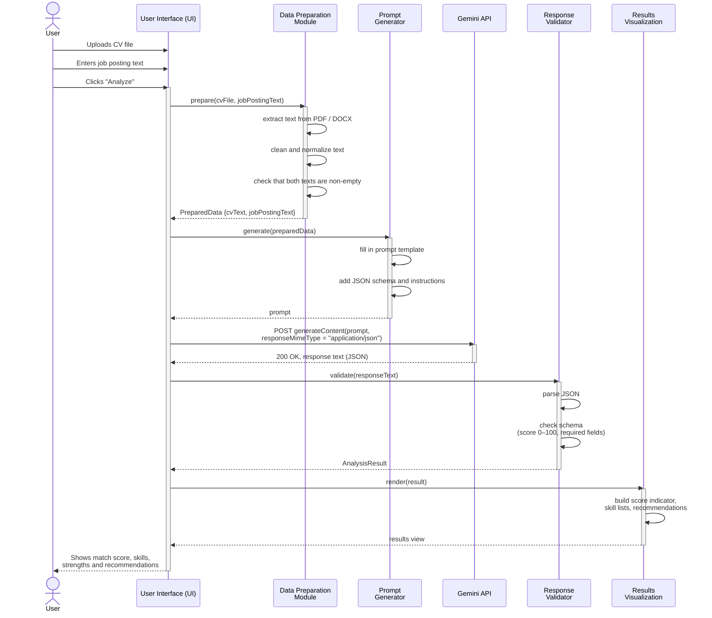
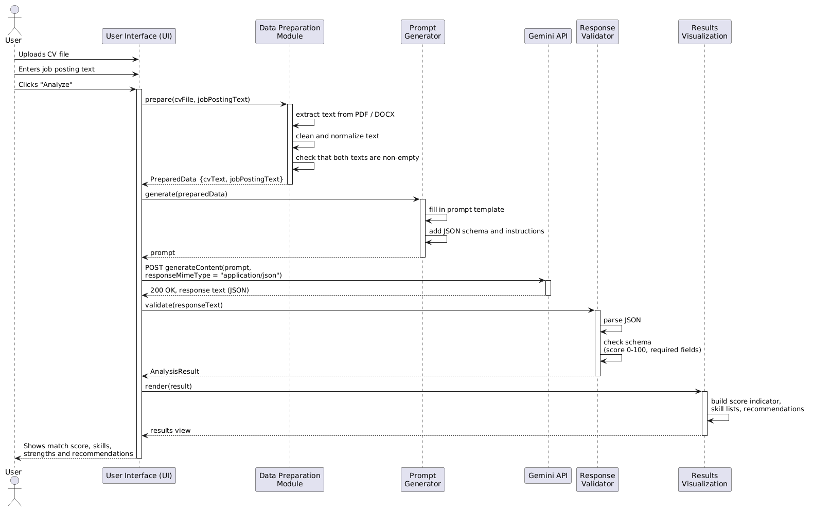
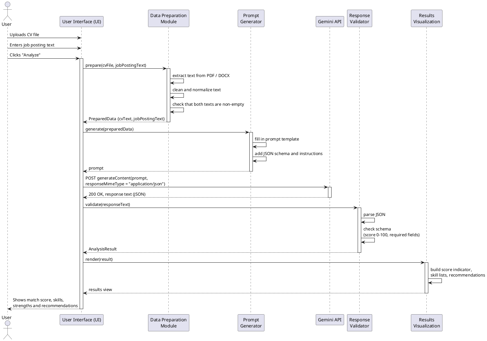

# cvmatch

## Component diagram

```mermaid
flowchart TB
    User["User"]

    subgraph CVMatch
        UI["User Interface (UI)"]

        IPrep(("IDataPreparation"))
        IPrompt(("IPromptGeneration"))
        IVal(("IResponseValidation"))
        IViz(("IResultsVisualization"))

        Prep["Data Preparation Module"]
        PromptGen["Prompt Generator"]
        Validator["Response Validator"]
        Viz["Results Visualization"]
    end

    IGemini(("generateContent<br/>(REST / JSON)"))

    subgraph GoogleCloud["Google Cloud"]
        Gemini["Gemini API"]
    end

    User -->|"CV file,<br/>job posting text"| UI

    UI -.->|"1. prepare(cv, jobPosting)"| IPrep
    UI -.->|"2. generate(data)"| IPrompt
    UI -..->|"3. send(prompt)"| IGemini
    UI -.->|"4. validate(response)"| IVal
    UI -.->|"5. render(result)"| IViz

    IPrep --- Prep
    IPrompt --- PromptGen
    IGemini --- Gemini
    IVal --- Validator
    IViz --- Viz
```

PlantUML source

```plantuml
@startuml CVMatch_Component
skinparam componentStyle rectangle

actor "User" as User

package "CVMatch" {
  [User Interface (UI)] as UI

  interface "IDataPreparation" as IPrep
  interface "IPromptGeneration" as IPrompt
  interface "IResponseValidation" as IVal
  interface "IResultsVisualization" as IViz

  [Data Preparation Module] as Prep
  [Prompt Generator] as PromptGen
  [Response Validator] as Validator
  [Results Visualization] as Viz
}

interface "generateContent\n(REST / JSON)" as IGemini

cloud "Google Cloud" {
  [Gemini API] as Gemini
}

User --> UI : CV file,\njob posting text

UI ..> IPrep : 1. prepare(cv, jobPosting)
UI ..> IPrompt : 2. generate(data)
UI ..> IGemini : 3. send(prompt)
UI ..> IVal : 4. validate(response)
UI ..> IViz : 5. render(result)

IPrep -- Prep
IPrompt -- PromptGen
IGemini -- Gemini
IVal -- Validator
IViz -- Viz
@enduml
```

## Sequence diagram

```mermaid
sequenceDiagram
    actor User as User
    participant UI as User Interface (UI)
    participant Prep as Data Preparation<br/>Module
    participant PromptGen as Prompt<br/>Generator
    participant Gemini as Gemini API
    participant Validator as Response<br/>Validator
    participant Viz as Results<br/>Visualization

    User->>UI: Uploads CV file
    User->>UI: Enters job posting text
    User->>UI: Clicks "Analyze"
    activate UI

    UI->>Prep: prepare(cvFile, jobPostingText)
    activate Prep
    Prep->>Prep: extract text from PDF / DOCX
    Prep->>Prep: clean and normalize text
    Prep->>Prep: check that both texts are non-empty
    Prep-->>UI: PreparedData {cvText, jobPostingText}
    deactivate Prep

    UI->>PromptGen: generate(preparedData)
    activate PromptGen
    PromptGen->>PromptGen: fill in prompt template
    PromptGen->>PromptGen: add JSON schema and instructions
    PromptGen-->>UI: prompt
    deactivate PromptGen

    UI->>Gemini: POST generateContent(prompt,<br/>responseMimeType = "application/json")
    activate Gemini
    Gemini-->>UI: 200 OK, response text (JSON)
    deactivate Gemini

    UI->>Validator: validate(responseText)
    activate Validator
    Validator->>Validator: parse JSON
    Validator->>Validator: check schema<br/>(score 0–100, required fields)
    Validator-->>UI: AnalysisResult
    deactivate Validator

    UI->>Viz: render(result)
    activate Viz
    Viz->>Viz: build score indicator,<br/>skill lists, recommendations
    Viz-->>UI: results view
    deactivate Viz

    UI-->>User: Shows match score, skills,<br/>strengths and recommendations
    deactivate UI
```

PlantUML source

```plantuml
@startuml CVMatch_Sequence
actor "User" as User
participant "User Interface (UI)" as UI
participant "Data Preparation\nModule" as Prep
participant "Prompt\nGenerator" as PromptGen
participant "Gemini API" as Gemini
participant "Response\nValidator" as Validator
participant "Results\nVisualization" as Viz

User -> UI : Uploads CV file
User -> UI : Enters job posting text
User -> UI : Clicks "Analyze"
activate UI

UI -> Prep : prepare(cvFile, jobPostingText)
activate Prep
Prep -> Prep : extract text from PDF / DOCX
Prep -> Prep : clean and normalize text
Prep -> Prep : check that both texts are non-empty
Prep --> UI : PreparedData {cvText, jobPostingText}
deactivate Prep

UI -> PromptGen : generate(preparedData)
activate PromptGen
PromptGen -> PromptGen : fill in prompt template
PromptGen -> PromptGen : add JSON schema and instructions
PromptGen --> UI : prompt
deactivate PromptGen

UI -> Gemini : POST generateContent(prompt,\nresponseMimeType = "application/json")
activate Gemini
Gemini --> UI : 200 OK, response text (JSON)
deactivate Gemini

UI -> Validator : validate(responseText)
activate Validator
Validator -> Validator : parse JSON
Validator -> Validator : check schema\n(score 0–100, required fields)
Validator --> UI : AnalysisResult
deactivate Validator

UI -> Viz : render(result)
activate Viz
Viz -> Viz : build score indicator,\nskill lists, recommendations
Viz --> UI : results view
deactivate Viz

UI --> User : Shows match score, skills,\nstrengths and recommendations
deactivate UI
@enduml
```

