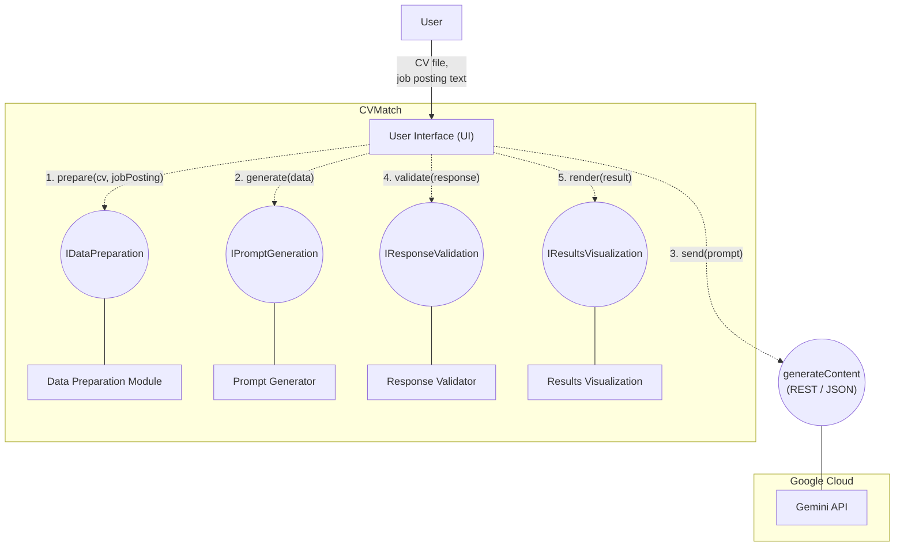
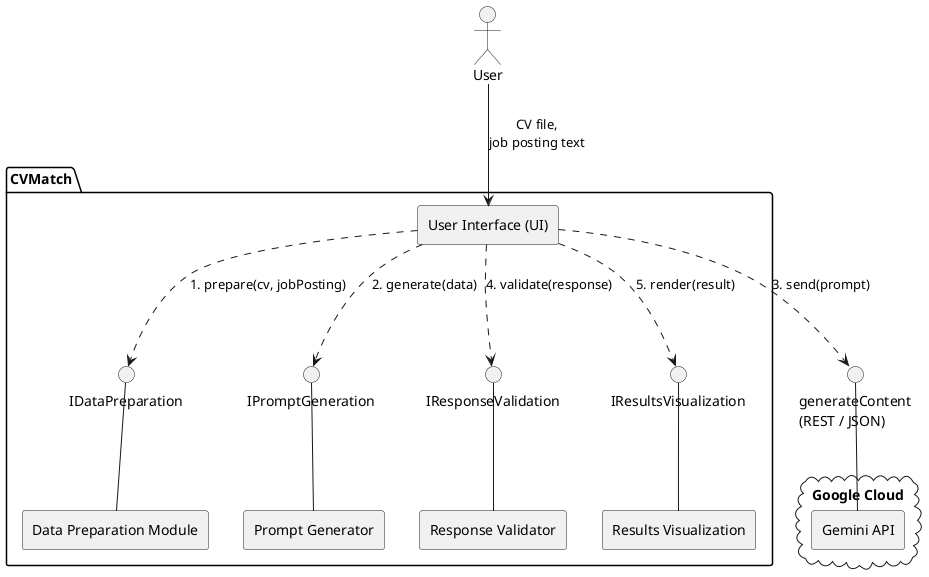
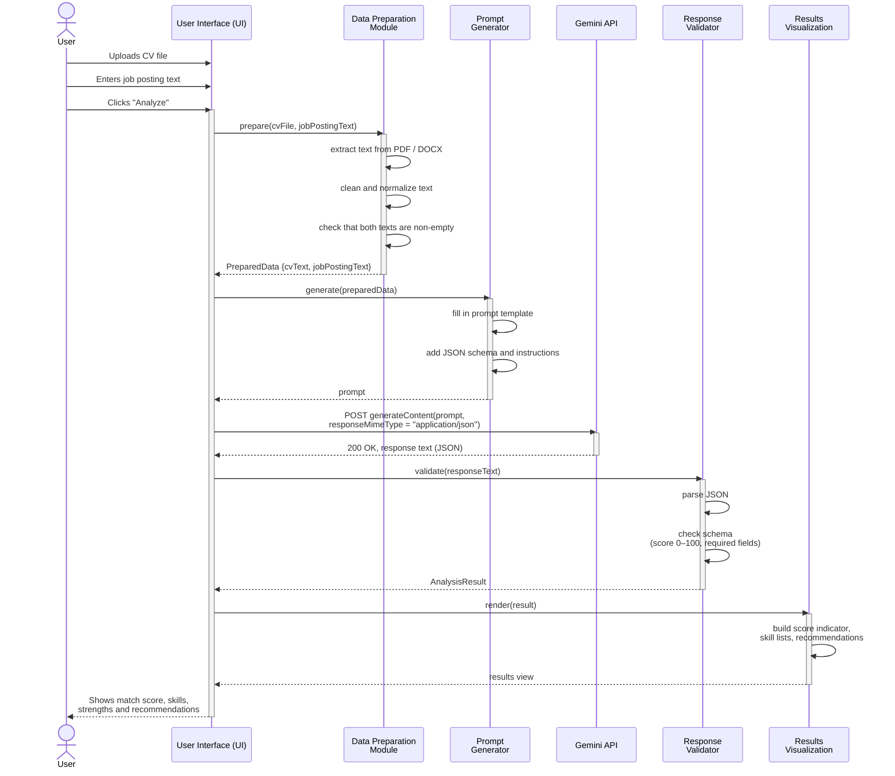
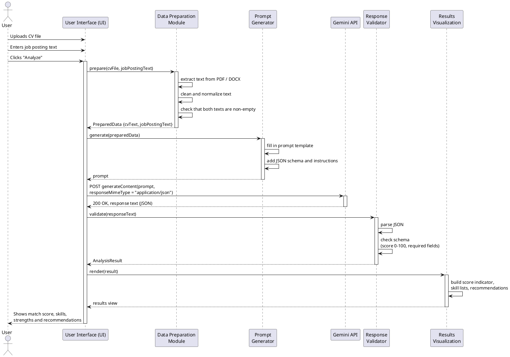

# cvmatch

CVMatch compares a candidate's CV with a job posting using the Gemini API. It returns a match score (0–100), matched and missing skills, the candidate's strengths, recommendations for improving the CV, and a verdict.

## Project structure

```
cvmatch/
├── prompts/
│   └── prompt.json          # system prompt, user prompt template, output format
├── data/
│   └── example_01–06.json   # example inputs (X) and expected outputs (y)
└── diagrams/
    ├── mermaid/             # component and sequence diagrams (Mermaid)
    └── plantuml/            # the same diagrams (PlantUML)
```

## Prompt

[`prompts/prompt.json`](prompts/prompt.json) contains the system prompt and a user prompt template with `{{cv}}` and `{{job_ad}}` placeholders. The model must return JSON with these fields:

| Field | Type | Description |
|---|---|---|
| `match_score` | number | Match score from 0 to 100 (mandatory requirements 70%, nice-to-haves 30%) |
| `matched_skills` | string[] | Requirements the candidate meets |
| `missing_skills` | string[] | Requirements the candidate is missing |
| `strengths` | string[] | 2–3 strengths for this position |
| `recommendations` | string[] | 2–4 specific CV improvement suggestions |
| `verdict` | string | `Strong match` (80–100), `Partial match` (50–79), `Weak match` (20–49), `Not a match` (0–19) |

## Examples

Each file in [`data/`](data/) contains an input `X` (`cv`, `job_ad`) and the expected output `y`.

| File | Scenario | Score | Verdict |
|---|---|---|---|
| [example_01](data/example_01.json) | Python developer -> Python backend position | 85 | Strong match |
| [example_02](data/example_02.json) | Junior Java developer -> Full-stack position | 52 | Partial match |
| [example_03](data/example_03.json) | Accountant -> DevOps engineer position | 5 | Not a match |
| [example_04](data/example_04.json) | Data analyst with e-commerce experience -> data analyst position | 82 | Strong match |
| [example_05](data/example_05.json) | Marketing specialist -> digital marketing manager (lacks management experience) | 62 | Partial match |
| [example_06](data/example_06.json) | Very short CV with little information -> QA tester position | 30 | Weak match |

## Diagrams

### Component diagram

Mermaid source: [`diagrams/mermaid/2-component.mmd`](diagrams/mermaid/2-component.mmd)



PlantUML version ([`diagrams/plantuml/2-component.puml`](diagrams/plantuml/2-component.puml)):


<details>
<summary>PlantUML source</summary>



</details>

### Sequence diagram

Mermaid source: [`diagrams/mermaid/3-sequence.mmd`](diagrams/mermaid/3-sequence.mmd)



PlantUML version ([`diagrams/plantuml/3-sequence.puml`](diagrams/plantuml/3-sequence.puml)):


<details>
<summary>PlantUML source</summary>



</details>
